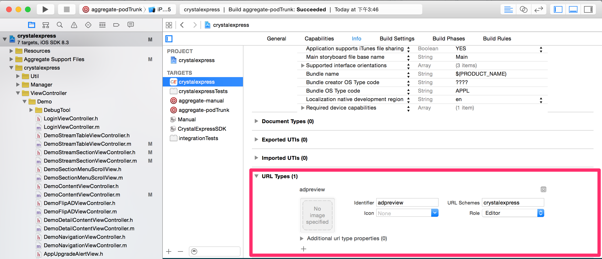

基於 iOS 深連結 (deeplinking), 透過掃描 QR code , 我們可以在真的 app 上預覽廣告的效果. 範例 QR code 的網址如下:
```
{urlScheme}://crystalexpress?action=adpreview?adid={number}
```

CrystalExpress SDK 會處理 adpreview 的網址, 並且忽略其他網址
## 如何啟用 app 深連結?


1. 首先你需要在您的 app 裡設定一個 URL scheme, 於 Project -> Info -> URL Types, 填入您 app 的 url scheme 以及其他欄位
2. 將下列代碼添加到 AppDelegate.m, 啟用 CrystalExpress 的廣告預覽功能

```objc
- (BOOL)application:(UIApplication *)application
                        openURL:(NSURL *)url
    sourceApplication:(NSString *)sourceApplication
                annotation:(id)annotation
{
        [I2WAPI handleDeepLinkWithUrl:url sourceApplication:sourceApplication];

        .....
        return YES;
}
```
