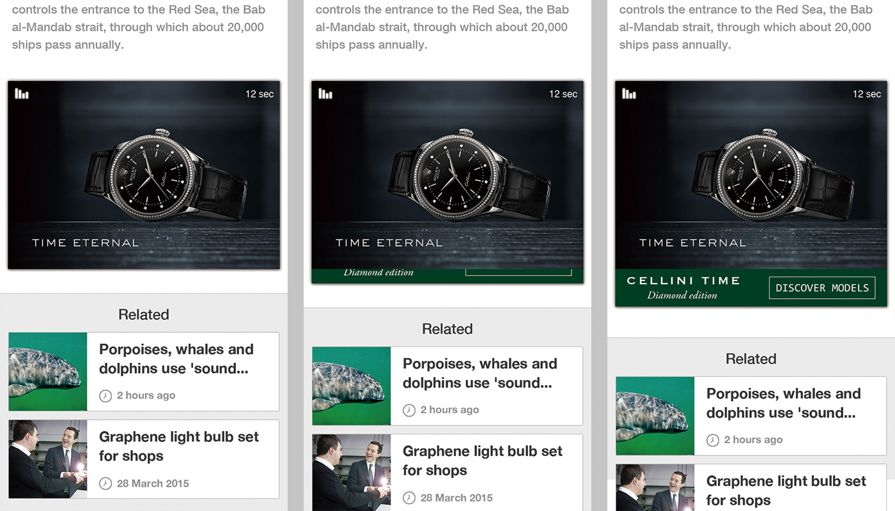

## 基本需求
- 內文廣告是針對 scrollView 類別頁面所設計

## 初始化 contentADHelper
- 我們提供了 contentADHelper 來管理內文廣告, 透過 contentADHelper 可以要求/管理內文廣告
- contentADHelper 可以同時管理多個內文廣告, 所以不需要一個頁面搭配一個 contentADHelper
- 可以在信息流 viewController 時初始化 contentADHelper, 並指派給內文 viewController
```objc
- (instancetype)init
{
    self = [super init];
    if (self) {
        .....

        // replace @"CONTENT" with your own placement name
        _contentADHelper = [[ContentADHelper alloc] initWithPlacement:@"CONTENT"];

        // set pulldown animation delegate to the right detail page viewController
        __weak typeof(self) weakSelf = self;
        [_contentADHelper setOnPullDownAnimation:^(UIView *view) {
            [[weakSelf.contentVCs objectAtIndex:weakSelf.curIndex] onPullDownAnimationWithAD:view];
        }];

        // preroll to preapre 1 content AD in advance
        [_contentADHelper preroll];

        .....
    }
    return self;
}
```

指派 contentADHelper 給內文 viewController
```objc
DemoContentViewController *newContentVC = [[DemoContentViewController alloc] initWithADHelper:_contentADHelper];
```

## 要求內文廣告
當您在準備內文內容時, 透過文章 id 去要求內文廣告
```objc
- (void)loadContentWithId:(NSString *)articleId
{
    .....
    // You may want a wrapper view on adView to add AD margin
    _adWrapperView = [[UIView alloc] init];
    _contentADView = [_contentADHelper requestADWithContentId:articleId];
    [_contentADHelper setScrollOffsetWithKey:articleId offset:currentScrollOffset];
    if (_contentADView) {
        CGFloat horMargin = (self.view.bounds.size.width - (_contentADView.bounds.size.width + 2*AD_MARGIN))/2.0f;
        [_adWrapperView setFrame:CGRectMake(horMargin, currentScrollOffset, _contentADView.bounds.size.width + 2*AD_MARGIN, _contentADView.bounds.size.height + 2*AD_MARGIN)];
        horMargin = (_adWrapperView.bounds.size.width - _contentADView.bounds.size.width)/2.0f;
        [_contentADView setFrame:CGRectMake(horMargin, AD_MARGIN, _contentADView.bounds.size.width, _contentADView.bounds.size.height)];
        [_adWrapperView addSubview:_contentADView];
        _adOffset = currentScrollOffset;
        currentScrollOffset += _adWrapperView.bounds.size.height;
        [_scrollView addSubview:_adWrapperView];

    } else {
        // add default offset if there's no content AD
        currentScrollOffset += 10;
    }

    // Here's the view under content AD
    _theViewUnderContentAd = [[UIView alloc] init];
    .....
}
```

## 處理內文廣告動畫
- `onPullDownAnimationWithAD:` 只有在特定的廣告格式(Card-Video-PullDown)才會發生回調



- 當此種廣告被使用者點擊, 互動卡片會從廣告的底端延展出來. 因此, scrollView 需要更新在內文廣告下方的 view 的位置
```objc
- (void)onPullDownAnimationWithAD:(UIView *)adView
{
    if (adView == _articleADView) {
        CGRect frame = [_adWrapperView frame];
        frame.size.height = adView.bounds.size.height + 2*AD_MARGIN;
        [_adWrapperView setFrame:frame];

        frame = [_theViewUnderContentAd frame];
        frame.origin.y = _adOffset + _adWrapperView.bounds.size.height;
        [_theViewUnderContentAd setFrame:frame];

        CGFloat finalContentOffset = _adOffset + adView.bounds.size.height + _theViewUnderContentAd.bounds.size.height;
        [_scrollView setContentSize:CGSizeMake(self.view.bounds.size.width, finalContentOffset)];
    }
}
```

## 傳送 viewController 和 scrollView 的事件
### 對 contentADHelper 更新 scrollView 的狀態

我們需要當 scrollView 狀態有變化時來觸發檢查是否要 開始/停止 播放信息流廣告
```objc
- (void)viewDidAppear:(BOOL)animated
{
    [super viewDidAppear:animated];
    [_contentADHelper checkAdStartWithKey:_articleId ScrollViewBounds:[_scrollView bounds]];
    .....
}

- (void)viewDidDisappear:(BOOL)animated
{
    [super viewDidDisappear:animated];
    // give CGRectZero to force content AD stop
    [_contentADHelper checkAdStartWithKey:_articleId ScrollViewBounds:CGRectZero];
    .....
}

- (void)scrollViewDidEndDragging:(UIScrollView *)scrollView willDecelerate:(BOOL)decelerate
{
    if (decelerate == NO) {
        [_contentADHelper checkAdStartWithKey:_articleId ScrollViewBounds:[scrollView bounds]];
    }
}

- (void)scrollViewDidEndDecelerating:(UIScrollView *)scrollView
{
    [_contentADHelper checkAdStartWithKey:_articleId ScrollViewBounds:[scrollView bounds]];
}
```

### 更新 scrollView 可視範圍
```objc
- (void)scrollViewDidScroll:(UIScrollView *)scrollView
{
    [_contentADHelper updateScrollViewBounds:[scrollView bounds] withKey:_articleId];
}
```
***
瞭解更多:

- [API reference](api-reference.md)
- [中英術語對照](https://github.com/roylo/CrystalExpressDocumentation-iOS-zh_CN/blob/master/terminology.md)
