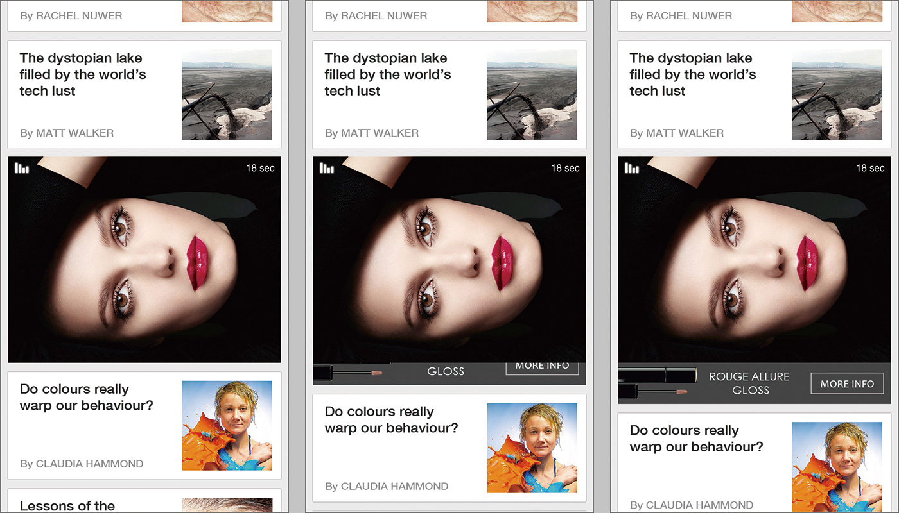

## 基本需求
- 此信息流廣告是基於 UITableViewController 類別而設計

## 初始化 streamADHelper
- 我們提供 streamADHelper 類別讓信息流廣告整合變得更容易, 透過 streamADHelper, 您可以要求並管理信息流廣告
- 在物件生成階段初始化 streamADHelper (例如. `viewDidLoad`)
- `preroll` 會準備一則信息流廣告讓我們可以塞入資料源(data source)裡的前幾個位置. 請在 `[self.tableView reloadData]` 前呼叫這個方法
```objc
- (instancetype)init
{
    self = [super init];
    if (self) {
        .....
        // replace @"STREAM" with your own placement name
        _streamHelper = [[StreamADHelper alloc] initWithPlacement:@"STREAM"];
    }
    return self;
}

- (void)viewDidLoad
{
    .....

    // prepare your tableview data source
    [self prepareDataSource];
    if (_streamHelper) {
        // set helper delegate to get AD event
        [_streamHelper setDelegate:self];

        // if you need customized ad width, add this line (Optional)
        [_streamHelper setPreferAdWidth:320.0f];

        // call preroll to prepare 1 stream AD before tableView load data
        [_streamHelper preroll];
    }
    [self.tableView reloadData];

    // update cell visible position allow helper to check whether AD should start/stop
    [_streamHelper updateVisiblePosition:[self tableView]];

   .....
}
```

## 要求信息流廣告
streamADHelper 根據傳入的 indexPath 回覆是否為一個信息流廣告的位置, 並回應相對應的廣告 view. 若拿到的 view 不是 nil, 請組建一個 UITableViewCell 並回傳, 若是 nil, 則回傳一般的內容 cell
```objc
- (UITableViewCell *)tableView:(UITableView *)tableView cellForRowAtIndexPath:(NSIndexPath *)indexPath
{
    // check whether indexPath is a stream AD
    UITableViewCell *cell = [self getADTableViewCellForTableView:tableView atIndexPath:indexPath];
    if (cell != nil) {
        return cell;
    } else {
        // return the normal content cell
        .....
    }
}

- (UITableViewCell *)getADTableViewCellForTableView:(UITableView *)tableView atIndexPath:(NSIndexPath *)indexPath
{
    UIView *adView = [_streamHelper requestADAtPosition:indexPath];
    if (adView != nil) {
        NSString *identifier = [NSString stringWithFormat:@"ADCell_%@_%d_%d", _sectionName, (int)[indexPath section], (int)[indexPath row]];
        UITableViewCell *cell = [tableView dequeueReusableCellWithIdentifier:identifier];
        if (!cell) {
            cell = [[UITableViewCell alloc] initWithStyle:UITableViewCellStyleDefault reuseIdentifier:identifier];
            [cell setSelectionStyle:UITableViewCellSelectionStyleNone];
        }

        [[cell contentView] addSubview:adView];
        [adView setFrame:CGRectMake((SCREEN_WIDTH - adView.bounds.size.width)/2.0f, _adVerticalMargin, adView.bounds.size.width, adView.bounds.size.height)];
        [[cell contentView] setBackgroundColor:[UIColor colorWithWhite:0.905 alpha:1.0]];
        return cell;
    } else {
        return nil;
    }
}
```

## StreamADHelper 回調
### 信息流廣告讀取完成
- 當信息流廣告的 view 已經準備好, SDK 會回調 `onADLoaded:atIndexPath:isPreroll`
    - `indexPath` 代表 SDK 計算出來希望塞入的目標位置
    - `isPreroll` 代表是否為事先準備的廣告要求
- 若這是個事先準備的廣告要求, 就不需要在次個主迴圈(main loop)才塞入資料源, 因為 tableView 還沒有呈現到用戶面前
- 回傳真正塞入資料源的 NSIndexPath 給 streamADHelper 讓其紀錄, 發生錯誤或是故意不塞入資料源時回傳 nil
```objc
- (NSIndexPath *)onADLoaded:(UIView *)adView atIndexPath:(NSIndexPath *)indexPath isPreroll:(BOOL)isPreroll
{
    // Don't place ad at the first place!!
    int position = MAX(1, [indexPath row]);
    NSMutableArray *dataSource = [_dataSources objectAtIndex:[indexPath section]];
    NSIndexPath *finalIndexPath = [NSIndexPath indexPathForRow:position inSection:[indexPath section]];

    if ([dataSource count] >= position) {
        // if this request is preroll, no need to insert in another main loop
        if (isPreroll) {
            NSMutableDictionary *adDict = [[NSMutableDictionary alloc] init];
            CGFloat adHeight = adView.bounds.size.height;
            [adDict setObject:[NSNumber numberWithFloat:adHeight + 2*_adVerticalMargin] forKey:@"height"];

            NSArray *indexPathsToAdd = @[finalIndexPath];
            [[self tableView] beginUpdates];
            [dataSource insertObject:adDict atIndex:position];
            [[self tableView] insertRowsAtIndexPaths:indexPathsToAdd
                                    withRowAnimation:UITableViewRowAnimationNone];
            [[self tableView] endUpdates];
        } else {
            dispatch_async(dispatch_get_main_queue(), ^(){
                NSMutableDictionary *adDict = [[NSMutableDictionary alloc] init];
                CGFloat adHeight = adView.bounds.size.height;
                [adDict setObject:[NSNumber numberWithFloat:adHeight + 2*_adVerticalMargin] forKey:@"height"];

                NSArray *indexPathsToAdd = @[finalIndexPath];
                [[self tableView] beginUpdates];
                [dataSource insertObject:adDict atIndex:position];
                [[self tableView] insertRowsAtIndexPaths:indexPathsToAdd
                                        withRowAnimation:UITableViewRowAnimationNone];
                [[self tableView] endUpdates];
            });
        }

        // return the real indexPath inserted into tableView
        return finalIndexPath;
    } else {
        // return nil if error
        return nil;
    }
}
```

### 處理信息流廣告動畫
- `onADAnimation:atIndexPath` 只有在特定的廣告格式(Card-Video-PullDown)才會發生回調



- 當此種廣告被使用者點擊, 互動卡片會從廣告的底端延展出來. 因此, tableView 需要配合動畫來更新 cell 的高度
```objc
- (void)onADAnimation:(UIView *)adView atIndexPath:(NSIndexPath *)indexPath
{
    NSMutableArray *dataSource = [_dataSources objectAtIndex:[indexPath section]];
    [UIView animateWithDuration:1.0 delay:0.0 options:UIViewAnimationOptionAllowUserInteraction animations:^{
        [[self tableView] beginUpdates];
        [[dataSource objectAtIndex:[indexPath row]] setObject:[NSNumber numberWithInt:adView.bounds.size.height + 2*_adVerticalMargin] forKey:@"height"];
        [[self tableView] endUpdates];
    } completion:^(BOOL finished) {

    }];
}
```

### 檢查 tableView 是否處於靜止狀態
為了提升使用者體驗, streamADHelper 只有在 tableView 處於靜止狀態時才會開始播放影音廣告. 因此, streamADHelper 會回調此函式來檢查現在是否為一個靜止狀態適合播放廣告

如果您的 UI 設計上有其他特效(不只是 tableView dragging), 可以在這個函式中檢查其他條件
```objc
- (BOOL)checkIdle
{
    return (![[self tableView] isDecelerating] && ![[self tableView] isDragging]);
}
```

## 傳送 viewController 和 tableView 的事件
### 激活/關閉 streamADHelper
streamADHelper 只有在已經激活時才會處理廣告. 所以我們必須在對的時間去激活(關閉) streamADHelper.
通常對的時間指的是 viewController 出現在使用者眼前的時候 (消失在使用者眼前的時候)
```objc
// stream will appear to the view
[_streamHelper setActive:YES];

// stream will disappear from the view
[_streamHelper setActive:NO];
```

### 對 streamADHelper 更新 scrollView 的狀態
我們需要當 scrollView 狀態有變化時來觸發檢查是否要 開始/停止 播放信息流廣告
```objc
- (void)viewWillAppear:(BOOL)animated
{
    [super viewWillAppear:animated];
    [_streamHelper scrollViewStateChanged];
    ....
}

- (void)viewDidDisappear:(BOOL)animated
{
    [super viewDidDisappear:animated];
    [_streamHelper scrollViewStateChanged];
    ....
}

- (void)scrollViewDidEndDragging:(UIScrollView *)scrollView willDecelerate:(BOOL)decelerate
{
    // No need to call if scrollView is still scrolling
    if (decelerate == NO) {
        [_streamHelper scrollViewStateChanged];
    }
    ....
}

- (void)scrollViewDidEndDecelerating:(UIScrollView *)scrollView
{
    [_streamHelper scrollViewStateChanged];
    ....
}
```

### 更新 tableView 的可視範圍
為了計算對的位置來要求/塞入信息流廣告, streamADHelper 需要獲取 `scrollViewDidScroll:` 事件來更新當下的可視範圍
```objc
- (void)scrollViewDidScroll:(UIScrollView *)scrollView
{
    [_streamHelper scrollViewDidScroll:scrollView tableView:[self tableView]];
    ....
}
```

## 更新 tableView 資料源
tableView 定期更新資料源的機制是相當常見的 (例如. 下拉更新). 當資料源被更新時, 同時 streamADHelper 也要清除之前已讀取被暫存的廣告
```objc
- (void)refresh
{
    [self.pullToRefreshView startLoading];
    [_streamHelper cleanADs];
    [self prepareDataSources];
    [self.tableView reloadData];
    [_streamHelper updateVisiblePosition:self.tableView];
    [self.pullToRefreshView finishLoading];
}

- (void)pullToRefreshViewDidStartLoading:(SSPullToRefreshView *)view
{
    [self refresh];
}
```
***
瞭解更多:

- [API reference](api-reference.md)
- [中英術語對照](https://github.com/roylo/CrystalExpressDocumentation-iOS-zh_CN/blob/master/terminology.md)
